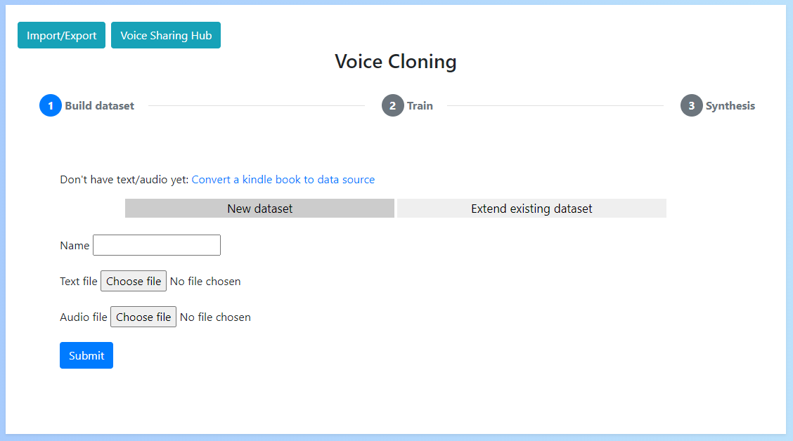

# Voice Cloning App

A Python/Pytorch app for easily synthesising human voices

## System Requirements
- **Windows 10 or Ubuntu 20.04+ operating system**
- **NVIDIA GPU with at least 4GB of memory**
- **Up-to-date NVIDIA driver (version 450.36+)**

## Key features
- Automatic dataset generation
- Easy train start/stop
- Support for kindle & audible as data sources
- Data importing/exporting
- Simplified training & synthesis
- Word replacement suggestion
- Windows & Linux support

## Video guide

**https://www.youtube.com/playlist?list=PLk5I7EvFL13GjBIDorh5yE1SaPGRG-i2l**

## Voice Sharing Hub

**https://voice-sharing-hub.herokuapp.com/**

## [Discord Server](https://discord.gg/wQd7zKCWxT)

## [FAQ's](faqs.md)

## Manual Guides
1. [Installation](install.md)
1. [Building the dataset](dataset/dataset.md)
2. [Training](training/training.md)
3. [Synthesis](synthesis/synthesis.md)

## Future Improvements
- Test pretrained weights for transfer learning
- Add support for alternative models
- Improved batch size estimation
- Multi-GPU support
- AMD GPU support
- Additional language support

## [How to make changes](maintenance.md)

## Acknowledgements
This project uses a reworked version of [Tacotron2](https://github.com/NVIDIA/tacotron2) & [Waveglow](https://github.com/NVIDIA/waveglow). All rights for belong to NVIDIA and follow the requirements of their BSD-3 licence.

Additionally, the dataset generation uses [DSAlign](https://github.com/mozilla/DSAlign) & [Silero](https://github.com/snakers4/silero-models).

Thank you to Dr. John Bustard at Queen's University Belfast for his support throughout the project.

Also a big thanks to the members of the [VocalSynthesis subreddit](https://www.reddit.com/r/VocalSynthesis/) for their feedback.

Finally thank you to everyone raising issues and contributing to the project.
